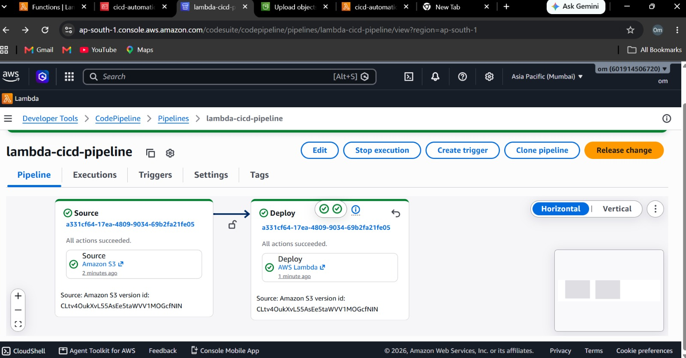
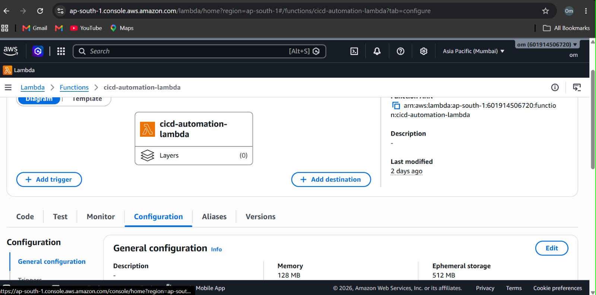
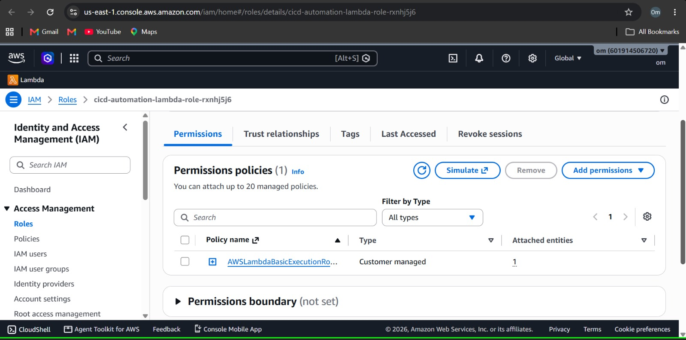
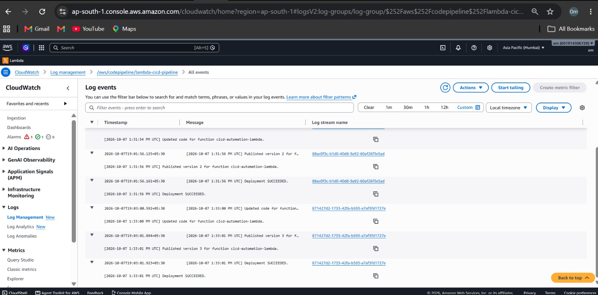
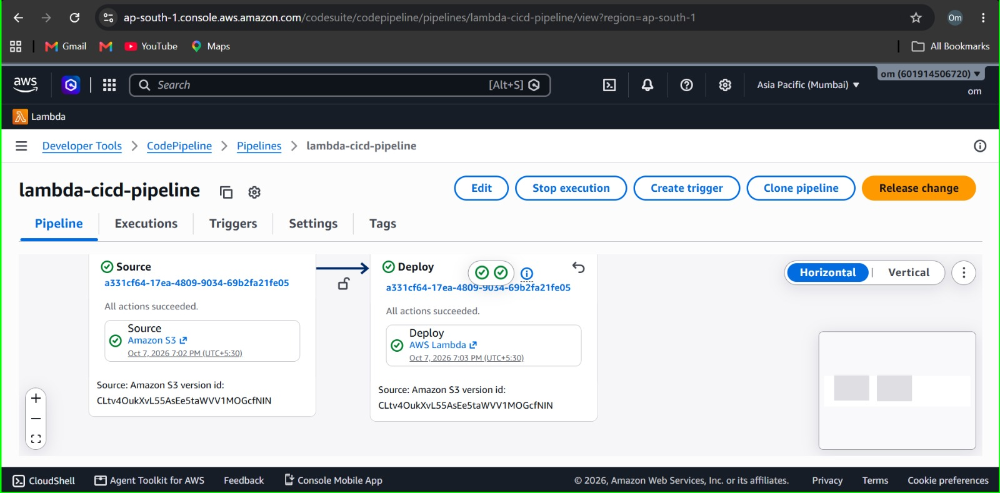

# Automating CI/CD Pipelines Using AWS Lambda

## 1. Project Title and Objective

### Project Title
Automating CI/CD Pipelines Using AWS Lambda

### Objective
The objective of this project is to automate deployment-related activities
using AWS Lambda and AWS CodePipeline.

This project demonstrates how an event-driven serverless function can
automatically perform deployment tasks when triggered by a CI/CD pipeline.

## 2. AWS Services Used

- **AWS Lambda:** Executes deployment automation logic.
- **AWS CodePipeline:** Automates and manages the pipeline workflow.
- **Amazon S3:** Stores the source files used by the pipeline.
- **AWS IAM:** Controls permissions required by AWS services.
- **Amazon CloudWatch:** Monitors Lambda execution and stores logs.

## 3. Architecture / Workflow

The project follows this workflow:

Amazon S3 → AWS CodePipeline → AWS Lambda → Deployment Automation

### Workflow Explanation

1. Application or deployment-related files are stored in Amazon S3.
2. AWS CodePipeline retrieves the source files.
3. The pipeline invokes the configured Lambda deployment action.
4. AWS Lambda executes the automation logic.
5. Lambda updates the function code and publishes a new version.
6. Amazon CloudWatch records execution logs and deployment results.

## 4. Implementation Steps

1. Created an Amazon S3 bucket to store source files.
2. Configured an AWS CodePipeline with an S3 source stage.
3. Created the Lambda function named `cicd-automation-lambda`.
4. Configured the required IAM execution role and permissions.
5. Added the Lambda deployment action to CodePipeline.
6. Executed the pipeline to test the automation workflow.
7. Verified Lambda execution and deployment results.
8. Monitored execution logs using Amazon CloudWatch.

## 5. Screenshots of Important Configurations and Results

### 5.1 CodePipeline Execution

### 5.2 Lambda Function Configuration

### 5.3 IAM Permissions

### 5.4 CloudWatch Execution Logs

### 5.5 Final Deployment Result

## 6. How to Run or Deploy the Project

1. Sign in to the AWS Management Console.
2. Open Amazon S3 and upload the required source files.
3. Open AWS CodePipeline and select the configured pipeline.
4. Start a pipeline execution or upload an updated source file.
5. Verify that the Source and Deploy stages complete successfully.
6. Open AWS Lambda to verify the function execution and published version.
7. Open Amazon CloudWatch to inspect the execution logs.

**Note:** The AWS resources, IAM permissions, and pipeline configuration
must be available before running the workflow.

## 7. Key Learnings

- Learned how to configure AWS CodePipeline.
- Understood how Lambda can automate deployment-related activities.
- Learned how IAM roles and permissions support secure execution.
- Practiced event-driven serverless automation.
- Learned to monitor Lambda execution using CloudWatch logs.
- Understood how source changes can initiate a deployment workflow.

## Conclusion

This project demonstrates an event-driven CI/CD workflow using AWS
CodePipeline and AWS Lambda. It provides practical experience with
serverless automation, IAM permissions, deployment versioning, and
CloudWatch monitoring.
